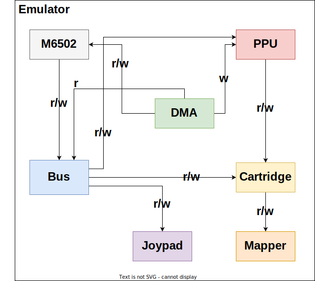

# Architecture

Coming from Java and C++ background, I had difficulty modelling NES hardware in Rust. There are lots of cyclic dependencies and Rust doesn't like it. NES's CPU needs to read and write from bus which also read and write to PPU. Sometimes, PPU needs to send a NMI interrupt request to the CPU. How can we model this dependency relationship in Rust? One could make CPU a top level component while all other components are controlled by CPU. But one problem with this design is that both CPU and PPU both need to access cartridge memory and where to fit the cartridge in this design? Inside PPU? Things will become ugly.

The best way I can come up is to create a structure `Emulator` to enscapulate all NES hardware components. Each component is wrapped by a shared pointer. When any of these components require an access to one other component, a weak pointer of that component will be passed. With this, it is possible for a component (like cartridge for example) to have references from two different components without cloning. I am not sure if this is idiomatic in Rust but it works.

Still, this approach is not perfect. For example, currently it is hard for a cartridge to access PPU without getting error messages from Rust borrow checker.

## Repository structure

### `nesty`

Platform independent emulator core

### `platform/desktop-sdl2`

Contains all code for desktop application

### `platform/web`

Contains all code for web application
