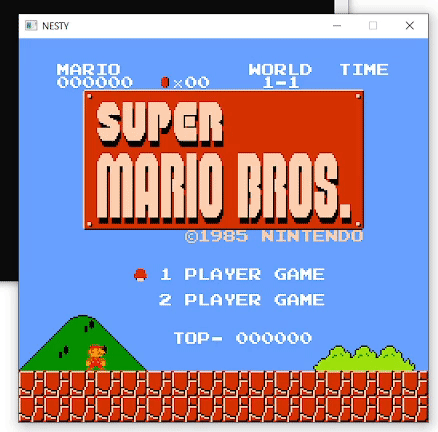

# Nesty

WIP NES emulator



Run:
```
cargo run --release "roms/Super Mario Bros. (World).nes"
```

TODO:

- Fix some PPU bugs
- Implement Mapper1 to play Space Harrier
- Run test ROMs
- Savestates
- Debugger (use imgui)
