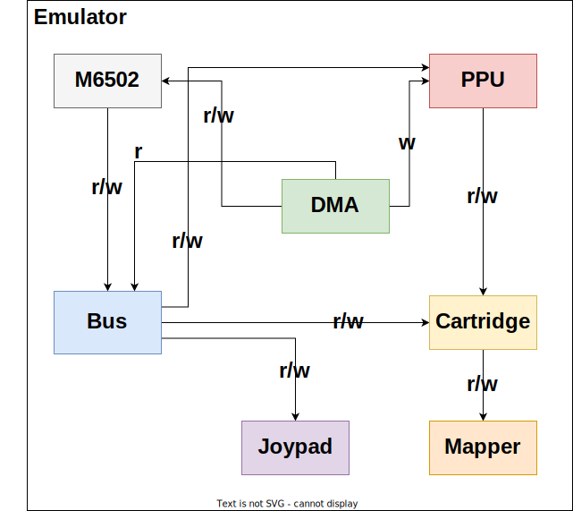

# Nesty

This is a WIP Nintendo Entertainment System emulator written from scratch in Rust for the sake of fun and learning. ~~Originally, I wanted to build this emulator so I can finally beat [Super Mario Forever](https://www.youtube.com/watch?v=in6RZzdGki8) with savestates.~~ Available in both desktop and web. [Try the live demo here!](https://marethyu.github.io/nesty/)

## Features

- Cycle-accurate 6502 CPU emulation, verified using nestest.
- Accurate PPU emulation (expect limitations since it is implemented with old school scanline-based renderer)
- Can emulate most NROM and MMC1 games to a reasonable accuracy and speed
- The emulator can run in both desktop and web.
- Savestates

## Architecture



Coming from Java and C++ background, I had difficulty modelling NES hardware in Rust. There are lots of cyclic dependencies and Rust doesn't like it. NES's CPU needs to read and write from bus which also read and write to PPU. Sometimes, PPU needs to send a NMI interrupt request to the CPU. How can we model this dependency relationship in Rust? One could make CPU a top level component while all other components are controlled by CPU. But one problem with this design is that both CPU and PPU both need to access cartridge memory and where to fit the cartridge in this design? Inside PPU? Things will become ugly.

The best way I can come up is to create a structure `Emulator` to enscapulate all NES hardware components. Each component is wrapped by a shared pointer. When any of these components require an access to one other component, a weak pointer of that component will be passed. With this, it is possible for a component (like cartridge for example) to have references from two different components without cloning. I am not sure if this is idiomatic in Rust but it works.

Still, this approach is not perfect. For example, currently it is hard for a cartridge to access PPU without getting error messages from Rust borrow checker.

## Some demos


## Building

### Desktop SDL2

```
cargo run --release --bin nesty-desktop-sdl2
```

### WASM Application

See the README file in platform/web for more details.

Keybindings:

| Key | Control |
| --- | --- |
|<kbd>←</kbd>|Left|
|<kbd>→</kbd>|Right|
|<kbd>↑</kbd>|Up|
|<kbd>↓</kbd>|Down|
|<kbd>A</kbd>|A|
|<kbd>S</kbd>|B|
|<kbd>Space</kbd>|Select|
|<kbd>Return</kbd>|Start|
|<kbd>I</kbd>|Open ROM (Desktop only)||
|<kbd>O</kbd>|Save state|
|<kbd>P</kbd>|Load state|

## TODO

- Fix some PPU bugs
- Run test ROMs
  * Pass ppuio cpu exec space test by implementing dummy reads
- More mappers, esp MMC3
- Run length encoding for savestates
- Rewind
- Add more features to the startup rom like flashing text
- Better error handling for web
- Improve webpage design - try NES.css
- native windows gui kit
- imgui+wgpu for debugger frontend (might need to implement message queues using [std::sync::mpsc](https://doc.rust-lang.org/std/sync/mpsc/))
- Nametable previews
- SNES emulation support

## Credits

- Comprehensive 6502 reference: https://www.masswerk.at/6502/6502_instruction_set.html
- [Nesdev](https://www.nesdev.org/wiki/Nesdev_Wiki), especially their articles on [PPU rendering](https://www.nesdev.org/wiki/PPU_rendering) and [PPU Scrolling](https://www.nesdev.org/wiki/PPU_scrolling)
- javidx9's NES emulator Youtube playlist: https://www.youtube.com/playlist?list=PLrOv9FMX8xJHqMvSGB_9G9nZZ_4IgteYf
- Bagmanov's NES ebook: https://bugzmanov.github.io/nes_ebook/
- Emudev community and Discord: https://emudev.org/
