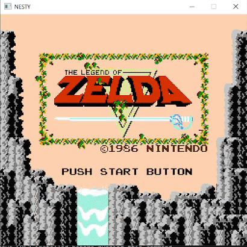

# Nesty

This is a Nintendo Entertainment System emulator written from scratch in Rust for the sake of fun and learning. ~~Originally, I wanted to build this emulator so I can finally beat [Super Mario Forever](https://www.youtube.com/watch?v=in6RZzdGki8) with savestates.~~ Available in both desktop and web. [Try the live demo here!](https://marethyu.github.io/nesty/)

## Features

- Cycle-accurate 6502 CPU emulation, verified using nestest.
- Accurate PPU emulation (expect limitations since it is implemented with old school scanline-based renderer)
- Can emulate most NROM and MMC1 games to a reasonable accuracy and speed
- The emulator can run in both desktop and web.
- Savestates

I pray that the future me will have some time to implement more features like debug views and SNES emulation support. Also hopefully Rust will finally have better and easy to use cross-platform GUI framework.

## Some demos




## Building

### Desktop SDL2

Make sure you have SDL2 installed before running this command

```
cargo run --release --bin nesty-desktop-sdl2
```

### WASM Application

See the README file in platform/web for more details.

## Keybindings

| Key | Control |
| --- | --- |
|<kbd>⇦</kbd>|Left|
|<kbd>⇨</kbd>|Right|
|<kbd>⇧</kbd>|Up|
|<kbd>⇩</kbd>|Down|
|<kbd>A</kbd>|A|
|<kbd>S</kbd>|B|
|<kbd>Space</kbd>|Select|
|<kbd>Enter</kbd>|Start|
|<kbd>F9</kbd>|Open ROM (Desktop only)||
|<kbd>F10</kbd>|Save state|
|<kbd>F11</kbd>|Load state|

## Tested games

- Donkey Kong
- Mario Bros
- Super Mario Bros
- Super Mario Forever
- Ice Climber
- Legend of Zelda
- Space Harrier
- Pac-Man

## Credits

- Comprehensive 6502 reference: https://www.masswerk.at/6502/6502_instruction_set.html
- [Nesdev](https://www.nesdev.org/wiki/Nesdev_Wiki), especially their articles on [PPU rendering](https://www.nesdev.org/wiki/PPU_rendering) and [PPU Scrolling](https://www.nesdev.org/wiki/PPU_scrolling)
- javidx9's NES emulator Youtube playlist: https://www.youtube.com/playlist?list=PLrOv9FMX8xJHqMvSGB_9G9nZZ_4IgteYf
- Bagmanov's NES ebook: https://bugzmanov.github.io/nes_ebook/
- Emudev community and Discord: https://emudev.org/
